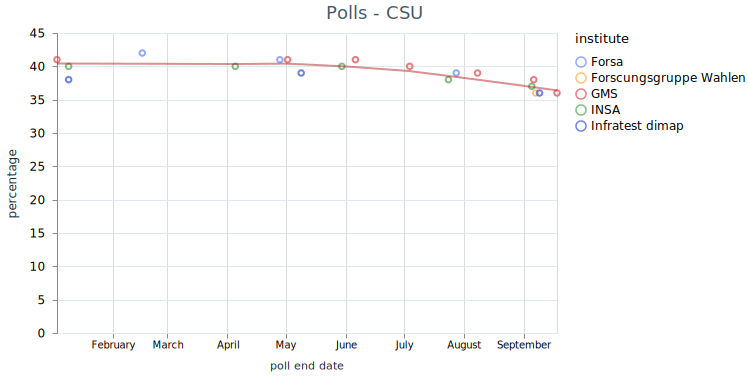
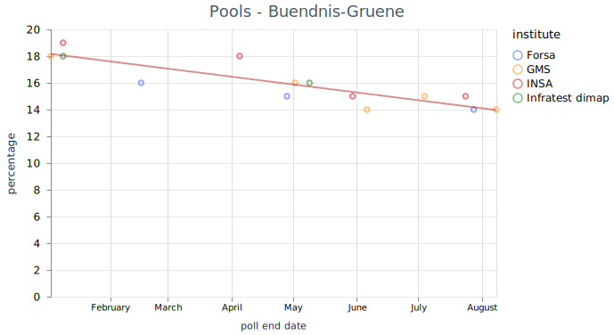
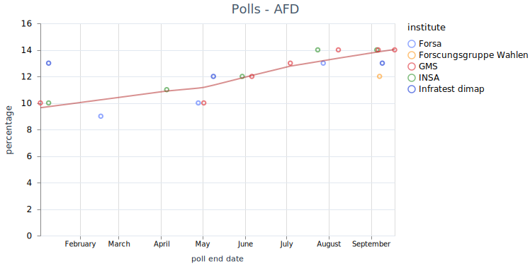

# Mastodon  - Election Predictions

## Introduction and OBJECTIVES

[Mastodon]([Annual Report 2022 - Mastodon Blog](https://blog.joinmastodon.org/2023/10/annual-report-2022/)) is a micro blogging service, that is federated and part of the fediverse. Depending on the source Mastodon 8.3 M users world wide ([fedidb](https://fedidb.org/)),  or 14.1 M users (@mastodonusercount@mastodon.social) on 24/09/2023. Because many services are able to federate with each other, it is possible to read data from other serveres as Misskey, Lemmy, Pixelfed and so on. Even some Wordpress-Blogs can be read.

Mastodon has a relative high number regional servers (see [OSM - Mastodon server](https://umap.openstreetmap.fr/en/map/mastodon-near-me-global-mastodon-server-list-by-co_828094)). A high number are German.  Mastodon had a strong spike in usage in November 2022 with 2.5 M monthly recurrent users. Currently the network has still [1.4 mio]([Servers - Mastodon](https://joinmastodon.org/servers)) monthly recurrent users.

Beside Mastodon, X was also investigated as possible source. But was to expensive for a research project. 

We analyse Mastodon toots about the bavarian election on Oct, 8th 2023. Therefore we apply a sentiment analysis. We atempt to differentiate regions and gender.

### Monitored Parties

The sentiment for the following parties will be watched (sorted from left to right):

| Party                     | Candidate(s)                        | Percentage 2018 |
| ------------------------- | ----------------------------------- | --------------- |
| Linke                     | Adelheid Rupp                       | 3.2             |
| SPD                       | Florian von Brunn                   | 9.7             |
| Grüne                     | Ludwig Hartmann & Katharina Schulze | 17.6            |
| FDP                       | Martin Hagen                        | 5.1             |
| CSU (Baverian only party) | Markus Söder                        | 37.2            |
| Freie Wähler              | Hubert Aiwanger                     | 11.6            |
| AfD                       | Katrin Ebner-Steiner & Martin Böhm  | 10.2            |

Source: [Landtagswahl in Bayern 2023: Kandidaten, Themen, Termin | BR24](https://www.br.de/nachrichten/bayern/landtagswahl-in-bayern-2023-termin-themen-kandidaten,TMD4uSM)

[Bayerische Linke kürt Adelheid Rupp als Spitzenkandidatin | BR24](https://www.br.de/nachrichten/bayern/bayerische-linke-kuert-adelheid-rupp-als-spitzenkandidatin,TZXl5yd)

### Polls

Tolls from different sources are listed at [wahlrecht.de]([Wahlumfragen zur Landtagswahl 2023 in Bayern (Sonntagsfrage #ltwby)](https://www.wahlrecht.de/umfragen/landtage/bayern.htm#fn-bp)). The time lime for each party for the 

The strongest party `CSU` loses percentages in the last year.

While its coalition partner `Freie Waehler` increases by a similar perentage.

Oppostion parties as  show a trend of loosing on the lefts spectrum and gaining in the ultra right spectrum (`AFD`).

## Population in Germany

Germany has slitly more woman (50.5 %) than man [Bevölkerungsstand: Amtliche Einwohnerzahl Deutschlands 2022 - Statistisches Bundesamt](https://www.destatis.de/DE/Themen/Gesellschaft-Umwelt/Bevoelkerung/Bevoelkerungsstand/_inhalt.html) . This is due to the age distrution of its citizen [population pyramide]([Bevölkerungspyramide: Altersstruktur Deutschlands von 1950 - 2060](https://service.destatis.de/bevoelkerungspyramide/index.html#!y=2023)) Because man have a higher mortability rate at higher ages.  

## Methods

### Monitoring

Following tags are monitored on the instance *chaos.social* by the topics:

- Bavaria: bayern bayernwahl bayernwahl2023 

- Election: wahlen wahlkampf wahlumfrage wahlen23 wahlen2023 

- Parties: spd csu gruene  grune gruenen grunen afd freiewaehler freiewahler fw fpd linke 

- Candidates: markussoeder markussoder soeder soder hubertaiwanger aiwanger hartmann martinhagen ebnersteiner

Some candidates were not included in the tag search, because the tags where not in used at the beginning of the study.

A wide set of topics have been selected to retrieve a maximum of taged posts. Throw the federation of instances, it is possible that not all instances share posts, or not all posts. Still only a single instance have been monitored, so that 

Search of posts without the need of tags, have been added during the monitoring with Mastodon version 4.2.  Developmentis done on the instance *mastodon.social*, when other instane follow, a stable release is up to there administration. Search without tags might retrieve addition posts.

The posts have been retrieve via the api:***instance_url/api/v1/timelines/tag/#{tag}*** Which is done without a login, therefore only public posts are monitored.

The api is requested every full hour starting 08/29/23 non stop on a raspberry pi. First data have been inserted 08/28/23. The monitoring is done with a Elixir programm that runs on Erlang's BEAM runtime. To increase stabiliy. Therefore each post is written for into four tables of a SQLite3 database. The toots table contains the post itself and some of its user data. The users table contains some data of the posts about the users, that wrote the posts.

The related table fields contains the fields a user can set, to contain some information about him-/herself. The related tags table contains all tags of every post.

### Data Analysis

The evaluation is done in an [Elixir Livebook](election_bavaria.livemd). First Exploration was done on a split of the dataset that was recored until 09/10/23, 12 days of full records. This dataset was used to fine tune the procedure. 

At first we decided to select all posts that contain any of the candidate names or the name Bavaria, or the party name CSU, as it is a regional party. 

The other parties are eligible nationwide. Than the special characters and html mark-ups are removed. The posts are filtered whether only a single party is mentioned.

The posts also contain a language lable, but this is set by the user or his/her application and is errorprone. Therefore, the language is detected by the model [***papluca/xlm-roberta-base-language-detection***]([papluca/xlm-roberta-base-language-detection · Hugging Face](https://huggingface.co/papluca/xlm-roberta-base-language-detection)).  The model is included in the Livebook smart cells.

The german sentiment analysis is done with the model [***oliverguhr/german-sentiment-bert***]([oliverguhr/german-sentiment-bert · Hugging Face](https://huggingface.co/oliverguhr/german-sentiment-bert)). The model is a python package. Therefore an attempt to use is in Elixir has been done with ONNX. The problem was the correct setting of the tokenizer (bert-base-german-cased). Therefore it was much simpler to use the Elixir library Bumblebee, that makes both useable with less code. The python code that generated the onnx file and the vocab.json is included.

The few English language posts are evaluated with the model [***finiteautomata/bertweet-base-sentiment-analysis***]([finiteautomata/bertweet-base-sentiment-analysis · Hugging Face](https://huggingface.co/finiteautomata/bertweet-base-sentiment-analysis)). 

The remaining posts are selected into the three groups, Bavarian, German, English.

For the porpuse of this project, following Mastodon instances are estimated to be used by bavarian users (only):

- muenchen.social

- augsburg.social

- mastodon.bayern

- nuernberg.social

- ploen.social

- wue.social (Würzburg)

- mastodon.dachgau.social

- sueden.social (hypothesis: low difference to other southern regions)

In addition the fields and notes of each user are scanned for Bavarian location names. 

As final seperation the gender of each user is estimated by:

1) name

2) user note text 

3) user fields

4) user picture?

b) get age distribution??? From text, from user image?

## Linklist

### Fediverse

- [fedidb](https://fedidb.org/)
- [OSM - Mastodon server](https://umap.openstreetmap.fr/en/map/mastodon-near-me-global-mastodon-server-list-by-co_828094)
- [Mastodon Python API](https://mastodonpy.readthedocs.io/en/stable/07_timelines.html)

### Twitter

- [APIs](https://developer.twitter.com/en/docs/twitter-api/tools-and-libraries/v2)

### Umfragen

[Sonntagsfrage – Umfragen Landtagswahlen (Wahlumfrage, Wahlumfragen)](https://www.wahlrecht.de/umfragen/landtage/)

## Monitoring Interruptions

22 hours no update from 30.09. 22:00 to 01.10. 20:00.
