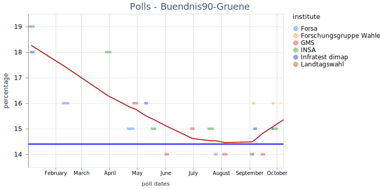
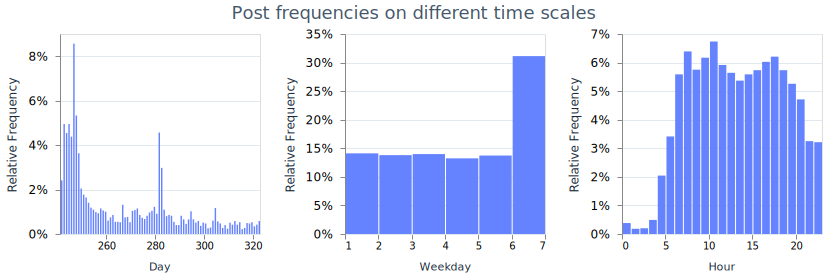

# Mastodon  - Election Predictions

## Introduction and Objectives

[Mastodon](https://blog.joinmastodon.org/2023/10/annual-report-2022/) is a micro blogging service, that is federated by the [ActivityPub](https://en.wikipedia.org/wiki/ActivityPub)
protocol and part of the fediverse. Depending on the source Mastodon 8.4 M users world wide ([fedidb](https://fedidb.org/)),  or 14.4 M users (@mastodonusercount@mastodon.social)
both on Oct. 10th 2023. Because many services are able to federate with each other, it is possible to read posts from other services as Misskey, Lemmy, Pixelfed and so on. Even some Wordpress-Blogs can be read.

Mastodon has a relative high number regional servers (see [OSM - Mastodon server](https://umap.openstreetmap.fr/en/map/mastodon-near-me-global-mastodon-server-list-by-co_828094)).
A high number are German.  Mastodon had a strong spike in usage in Nov. 2022 with 2.5 M monthly recurrent users. Currently the network has still [1.7 mil.](https://joinmastodon.org/servers) monthly recurrent users.

Beside Mastodon, [X](https://developer.twitter.com/en/docs/twitter-api) was also investigated as possible source. But was excluded for
[monetary reasons](https://www.heise.de/news/API-Zugriff-nur-gegen-Geld-Ueber-100-Forschungsprojekte-zu-X-Twitter-gestoppt-9355078.html?wt_mc=sm.red.ho.mastodon.mastodon.md_beitraege.md_beitraege).
We will use the terms posts and toots interchangebly. One limiting issue is the sample size of users, that use these services. The other demographics.

We analyse Mastodon toots with the topic Bavaria state election which took place on Oct. 8th 2023. We apply a sentiment analysis. We attempt to differentiate regions.

We use the sentiment only, we do not use the frequencies of mentioned persons or hastags, followers, favorisation, reblogs or replies. Especially some only, count interaction, but not shared opion.
In addition we only did not try to monitor [voting intention)(https://www.sciencedirect.com/science/article/pii/S0740624X21000940).

### Monitored Parties

The sentiment for the following parties and parties were monitored (sorted from left to right):

| Party                     | Candidate(s)                        | Percentage 2018 | Percentage 2023 |
|:------------------------- |:----------------------------------- |:--------------- |:--------------- |
| Linke                     | Adelheid Rupp                       | 3.2             | 1.5             |
| SPD                       | Florian von Brunn                   | 9.7             | 8.4             |
| Grüne                     | Ludwig Hartmann & Katharina Schulze | 17.6            | 14.4            |
| FDP                       | Martin Hagen                        | 5.1             | 3.0             |
| CSU (Baverian only party) | Markus Söder                        | 37.2            | 37.0            |
| Freie Wähler              | Hubert Aiwanger                     | 11.6            | 15.8            |
| AfD                       | Katrin Ebner-Steiner & Martin Böhm  | 10.2            | 14.6            |

Source: [Landtagswahl in Bayern 2023: Kandidaten, Themen, Termin | BR24](https://www.br.de/nachrichten/bayern/landtagswahl-in-bayern-2023-termin-themen-kandidaten,TMD4uSM)

[Bayerische Linke kürt Adelheid Rupp als Spitzenkandidatin | BR24](https://www.br.de/nachrichten/bayern/bayerische-linke-kuert-adelheid-rupp-als-spitzenkandidatin,TZXl5yd)

## Bavaria Demographics

Bavaria has about 13.3 mi. inhabitants and slightly more woman (50.5 %) [Bevölkerung in den Gemeinden Bayerns nach Altersgruppen und Geschlecht](https://www.statistik.bayern.de/mam/produkte/veroffentlichungen/statistische_berichte/a1310c_202200.pdf).
This is due to the age distribution of its citizen, because man have a higher mortability rate at higher ages. The peer group aged 40 to 50 is the first one with more than 50 % women.
All younger peer groups show an surplus of men by two to five percent. On the other hand, the peer group of age 75 or older shows a surplus of women of about 17 %.

## Methods

### Monitoring

Following tags are monitored on the instance *chaos.social*. We group the tags by topics:

- Bavaria: bayern bayernwahl bayernwahl2023 
- Election: wahlen wahlkampf wahlumfrage wahlen23 wahlen2023 
- Partys: spd csu gruene  grune gruenen grunen afd freiewaehler freiewahler fw fpd linke
- Candidates: markussoeder markussoder soeder soder hubertaiwanger aiwanger hartmann martinhagen ebnersteiner

Some candidates were not included, because their name were not used as tags at the beginning of the study. We only used German words as tags.

A wide set of topics have been selected to retrieve a maximum of tagged posts. Due to the concept of federation of instances, it is possible that not all instances share posts, or not all posts.
Still only a single instance have been monitored to reduce the need of removing duplicates with different ids on each instance.

Search of posts without the need of tags, has been released during the monitoring with Mastodon version 4.2 in the end of Sep. 2023.  It was added on Oct. 3rd on chaos.social.
Reindexing stated have been finished on Oct. 5th. The search was added on Oct. 7th to the monitoring.

We retrieve the tags via the public timeline of the instance and the search via the search api

* ***instance_url/api/v1/timelines/tag/{tag_name}*** 
* ***isntance_url/api/v2/search?q={search_word}***

Search of tags in the public timeline is done without a login, therefore only public posts are monitored. For the search a bearer token is needed. During the addition of the search the limit of requested post was increased from 20 (default) to 40 (maximum).

The posts are requested every full hour starting Aug. 29th 2023. The retrieval is done with a Elixir programm that runs on Erlang's BEAM runtime, to increase stabiliy.
For instance automatic recovering after failing connections. Each post is written into four tables of a SQLite3 database. The `toots` table contains the post itself and some of its meta data.
The `users` table contains some data of the posts about the users, who wrote the posts.

The related table `fields` contains the fields a user can set using key value pairs, to add some information about him-/herself. The related `tags` table contains all tags of each post.

Depending on the search term and how often it is used in posts, the time range of 20/40 vary. For some search terms, that are less frequent used, it lasts back several years.
For other terms it ranges back several days only. This behaviour partially heals interruptions in the monitoring service.
Or can be used to look back, when using very specific search terms together with specifies as the use language.

### Data Analysis

#### Data Preparation

The evaluation is done in an [Elixir Livebook](election_bavaria.livemd). First exploration was done on a sub-sample of the dataset, which was recorded until Sep. 10th 2023.
About 12 days of full records. This dataset was used to fine tune the analysis. This notebook is than applied on the full sample.
The texts are cleaned the texts to exclude:

- Html tags.
- Links.
- Characters: #, @ and _ .
- Removed double spaces.

The decision whether a post can be used for further Analysis is done by filtering in three stages:

1) Cleaned text contains more than 50 characters of cleaned text.
2) Keep only posts specific to Bavaria.
3) Keep only posts that is attributable a single/dominant party.

#### Regional Filter

The regional filter accepts any post that abides to any of the the three rules

1) Post must name of any local entity
2) Post must name of any candidate
3) Post must name csu (single regional party)

We use 3890 local entities from the state name down to village names. We do not use the 7860 sub-district names, as they amount is much higher as and includes some major common German words (e.g. Gern, Oder).
Is also partially true for villages names, (e.g. Wald). This filter method, may also keep posts which mention similar names, in other regions of the world.

### Attribute Sentiment to Party

To select posts, that's sentiment can me attributed to a party we test two methods:

1) Keep posts, that only name a single party, or their candidate(s).
2) Keep posts, that contains a dominant party, that is mentioned more often than, all other party combined.

#### Spatial Differentiation

Based on [OSM - Mastodon server](https://umap.openstreetmap.fr/en/map/mastodon-near-me-global-mastodon-server-list-by-co_828094) following Mastodon instances are estimated to be used by Bavarian users.

We added sueden.social based on the untested hypothesis, that the overall sentiment in southern Germany is similar to Bavaria.
In addition the fields and notes of each user are scanned for Bavarian location names [OpenData Geodaten Bayern](https://geodaten.bayern.de/opengeodata/OpenDataDetail.html?pn=verwaltung) from the state name to village name.

This method is precise as the fields are key value stores. Location names that are common German words will not be misunderstood. In addtition location with same names, but in different regions are kept.
When filtering by the user text, we can not filter by the keys above, but rely on the entity names alone.

The full region selection algorithm is shown below.


#### Sentiment Analysis

The minimum of 50 characters was used, to reduce the miss classification on shorter texts.
The posts all contain a language label, but this is set by the user or his/her application and is therefore error prone.
We detect the language by the model [***papluca/xlm-roberta-base-language-detection***](https://huggingface.co/papluca/xlm-roberta-base-language-detection) with a limit 0f 100 tokens.
The model is included in the Livebook smart cells.

The german sentiment analysis is done with the model [***oliverguhr/german-sentiment-bert***](https://huggingface.co/oliverguhr/german-sentiment-bert).
We use the limit of 512 possible tokens of the model. We only use the first 512 tokens and do not combine the analysis of multiple sections of the text,
as 512 tokens is far longer than the maximum post length of mastodon of 500 characters as default. [OPENAI](https://platform.openai.com/tokenizer)
estimates 4 characters per token, but this figure does very per language and tokenizer. The German Sentiment Bert model is available as a python package.
Therefore we attempted to use is in Elixir via ONNX. The problem was the correct setting of the tokenizer (bert-base-german-cased). Therefore was a  simpler alternative to use the Elixir library Bumblebee.

The English language posts are evaluated with the model [***finiteautomata/bertweet-base-sentiment-analysis***](https://huggingface.co/finiteautomata/bertweet-base-sentiment-analysis) with the limit of 130 tokens.

The whole language classification process is shown below. The sentiment is converted from three classes (positive, negative, neutral) with a probability of 1 to a range -1 (negative) to 1 (positive).


#### Sentiment Graphs

The Sentiment is shown for the three regions/languages.

1) Bavaria.
2) Other German.
3) English.

For all parties most sentiments are neutral or negative. Whether positive sentiment is due to irony can not be tested automatically.

#### Correlate poll and sentiments

The polls which have a start and end date are converted into a daily and weekly timeline for each party. Each day form
start day to end day is unrolled and given the poll results for that party. When a day has a value estimated by different polling agencies,
the poll result are averaged for each party. Missing daily values where filled with forward feed first and than a backward feed. The days are encoded as day of the year (day).
For the weekly timeline we take median day when each poll were executed. This median day was converted into a calendar week. When different polls were made, the results are averaged for each party.
The daily sentiment data were converted and filed in a similar fashion.
Time timelines are aligned in time by latest start date and the earliest end date. The alignments in values is done
by converting the poll results into factions and mapping the range of value of -1 to 1 to 0 to 1.

We want to estimate of either the polling or sentiment time line delayed, and how long. Therefore we estimate the cross correlation between the timelines. We adjust the timeline further by the offset between them.
For the adjusted time lime we estimate the linear regression between sentiment and polling.
**TODO** Bavarian Sentiments for weekly aggregate

## Results

### Polls

As a reference the sentiment analysis will be compared to polls. Polls from different sources are listed at [wahlrecht.de](https://www.wahlrecht.de/umfragen/landtage/bayern.htm#fn-bp).
With that we construct the timeline of the meta poll. The time lime for each party for the is shown below. Fitting is done with a loess fit with a bandwidth of 0.5 at the most
median datetime of each poll in dark red. The result of the election is shown as a blue line.

The strongest party `CSU` loses about three percent points since the start of the year 2023 with an result of 37 % at the election.


While its coalition partner `Freie Waehler` increases by five percent points and win 15.8 % of all votes.


Opposition parties as  show a trend of loosing on the lefts spectrum and gaining in the ultra right spectrum (`AFD`). As the Linke only wins less then the percent in every poll, it is not listed by every polling institute.




Both Linke and and FDP did not meet the quorum of five percent. We therefore decided to omit the graphs.
Overall the fit of polls for each party is at most one percent of the final result.

The last polls before the election we conducted by Forschungsgruppe Wahlen and INSA.
Forschungsgruppe Wahlen shows an average error per party of 0.87 percent points and INSA 0.73 percentage points.
The larger error for Forschungsgruppe Wahlen is caused because they did not add a estimation for *Die Linke*.

### Posts

In the *sub-sample* the cleaned posts with more than 50 characters in the evaluation data set contains 217 (median) and 248 ± 189 (average and standard deviation) characters. The maximum was above 5000 characters.
While in the full sample this changes to 281 ± 358 with a maximum of over 1900 characters and a median of 228 characters.
As only German words were selected as search terms, the amount of English posts are very limited. Which might also be due to the regional nature of the election.
From the two methods of attribution sentiment towards to party, a) keeping only posts that mention only one single party or there candidates, or b)
keeping posts that have a dominant party (or its candidates), that are mentioned *more* than 50 % of the times. After applying all filters to the *sub-sampled* dataset
we either keep 39 % of all posts (method a), or 49 % of all posts (method b). The connection between post and party is more clear with method a), but we choose the method b), as more posts are kept.
Of the *sub-sample* dataset we thus label 8.1 % of posts as Bavarian. 6.14 % due the uses instance, 0.4 % due to a Bavarian location a user field and 2.0 % due to a Bavarian location name in the user notes.
In the *full sample* 3.88 % percent of users are from Bavaria. 2.63 % percent due to instance, 0.17 % due to user fields and 1.19 % due to user notes.
Although more than 15 % of German inhabitants are Bavarian.

The selected German and Bavarian posts mainly where posted during the day, with two peek times, the morning and afternoon. While Sunday shows a higher frequency of toothing,
the other weekday share similar frequencies. The days with the highest frequencies are is the 247th day (Sept 4th) and the election day (Oct 8th). The time is recored in UTC.
In general we say much more posts durcing the Aiwanger afair, than around the election day.


### Sentiments

In the *sub-sample* only the parties FW, CSU and AFD where mentioned often to contain multiple posts for most days.
Fitting is done with a loess fit with a bandwidth of 0.5.
About 36 % of all toots mention the CSU as main poltical topic. The average sentiment (loess fit) of the CSU ranges from -0.5 to -0.4.


About 43 % percent of the posts main topic is the FW. The average sentiment (loess fit) for the FW is around -0.5.


The AFD was as mentioned in eleven percent of all filtered posts. The the loess fit of the sentiment is in the range of -0.4.


The count of mentioned parties over the full filtered sample sample is listed in the table below:

| Party  | Percentage            | Support Bavaria | Percentage Bavaria | Election Result |
| ------ | ---------------------:| ---------------:| ------------------:| ---------------:|
| AFD    | 11.5 %                | 37              | 14.6 %             | 14.6 %          |
| CSU    | 36.6 %                | 176             | 38.6 %             | 37.0 %          |
| FDP    | 1.7 %                 | 6               | 1.3 %              | 3.0 %           |
| FW     | 43.9 %                | 214             | 46.9 %             | 15.8 %          |
| Gruene | 1.4 %                 | 4               | 0.9 %              | 14.4 %          |
| Linke  | 1.3 %                 | 9               | 2.0 %              | 1.5 %           |
| SPD    | 3.6 %                 | 10              | 2.2 %              | 8.4 %           |

These Percentages are near the election result of the CSU, Linke, but very different for the Freie Waehler.
Therefore, we estimate the same data again, but only withinthe time periode of
doy 260 (Sep. 17th) to 280 (Oct. 7th). After the Aiwanger afair calmed down to the day before the election.

| Party  | Percentage | Support Bavaria | Percentage Bavaria | Election Result |
| ------ | ----------:| ---------------:| ------------------:| ---------------:|
| AFD    | 19.8 %     | 10              | 12.5 %             | 14.6 %          |
| CSU    | 51.6 %     | 43              | 53.8 %             | 37.0 %          |
| FDP    | 1.3 %      | 0               | ---  %             | 3.0 %           |
| FW     | 19.8 %     | 20              | 20.0 %             | 15.8 %          |
| Gruene | 2.5 %      | 2               | 2.5 %              | 14.4 %          |
| Linke  | 0.7 %      | 1               | 1.25 %             | 1.5 %           |
| SPD    | 4.2 %      | 4               | 5.0 %              | 8.4 %           |

This increases the accuracy for the AFD, FW, Linke and SPD, but in contrast we now strongly overestimate
the CSU and still strongly underestimate the Gruene, and have no data on the FDP in Bavaria.
Finally, we add the condition to only keep the most positive posts per user. This closer to a voting intent.
We still overestimate the CSU and FW. The results for the Gruene, and SPD got better, while the results for the AFD
is more different to the election result.
All this filtering results in very small supports.

| Party  | Percentage | Support Bavaria | Percentage Bavaria | Election Result |
| ------ | ----------:| ---------------:| ------------------:| ---------------:|
| AFD    | 17.8 %     | 4               | 8.2 %              | 14.6 %          |
| CSU    | 51.6 %     | 25              | 51.0 %             | 37.0 %          |
| FDP    | 1.3 %      | 0               | ---  %             | 3.0 %           |
| FW     | 20.0 %     | 13              | 26.5 %             | 15.8 %          |
| Gruene | 3.2 %      | 2               | 4.1 %              | 14.4 %          |
| Linke  | 1.3 %      | 1               | 2.0 %              | 1.5 %           |
| SPD    | 4.8 %      | 4               | 8.2 %              | 8.4 %           |

All this filtering for Bavaria does not result in much more precise results.
Filtering out early data generally result in more precise data, except for the CSU.

Filtering for Bavaria corrects the result parties with smaller support. But only result in less pronounced changes
for the CSU und FW.

### Compare Sentiments and Polls

$$
S_n(party) = \frac{S(party) + 1}{2}
$$

The sentiment is shifted from the range -1 to 1 to the range 0 to 1.

The sentiment of the posts where aggregated for the same calendar week, with the mean function.
Missing values are filled forward filled first and than backward filled.

$$
S_p (party) =  \frac{S_n(party)}{∑_{party} S_n} 
$$

Than the sentiment is converted into a ratio of sentiment per party by the sum of the sentiments of all parties for the same week. When comparing the daily agggregate and the weekly aggregate, we can see, that the variance is much heigher
for the sentiment campared to the polls. This strongly reduces for the weekly aggregate, but still here the timelines do not correlate.


Still the proportioal Sentiment for the FW is much higher, than the election result. The sentiment only also stronlgy overestimate the poll result of the FW.
We would also overestimate the result of the AFD and again underestimate the result of the CSU, at any given point in time.


The graph, that compares the polling result to the Sentiments, shows that the man dependency is the party itself.


**TODO OFFSET**
All graphics show limited visual correlations in the timelines. Therefore no offset of the cross correlation has been computed.
As the predict is already grouped into calendar week, we do not estimate the difference between Bavarian an other German posts.
For the calendar week 40 (week of the election) the sentiment based election prediction is shown below.
This approach strongly overestimates smaller parties and left wing parties. The prediction of all parties articlemuch closer to each other.
In addition to the bare sentiment for KW. We tried a linear fit between the polls and the weekly sentiment.
The parties are one-hot encoded. Hence, the sum of the intersection and the slope for the party,
can be seen as intercept for each party.
The dependency is much stronger on the party. The slope for the sentiment is only 0.0284.
The r²-score on the test dataset is 0.998. The fit for calendar week 40, is shown in the table below.
The average error, 0.35 percentage points. This is less than half of the error of the last polls.

| Party  | Sentiment KW 40 | Fit KW 40 | Election Result |
| ------ | ---------------:| ---------:| ---------------:|
| AFD    | 15.3            | 13.8 %    | 14.6 %          |
| CSU    | 15.2            | 36.5 %    | 37.0 %          |
| FDP    | 13.2            | 3.2 %     | 3.0 %           |
| FW     | 12.6            | 16.1 %    | 15.8 %          |
| Gruene | 20.6            | 14.5 %    | 14.4 %          |
| Linke  | 8.4             | 1.5 %     | 1.5 %           |
| SPD    | 14.3            | 9.0 %     | 8.4 %           |

**TODO**
For the *sub-sampled* data.
The standard deviation in the daily pool timeline is 0.005 (CSU), 0.009 (FW) and 0.005 (AFD) during the twelve day long sub-sample. During the same time the standard deviation for the sentiment is much larger 0.05 (CSU), 0.035 (FW) and 0.15 (AFD).
Therefore a linear regression on the polls vs the sentiments, shows that the polls are independent from the sentiments.

## Discussion

Each polls has at least a sample size of 1000 people. We monitore posts. We do not aggregate posts for each person, nor do we create timelines for specific persons.
The *sub-samples* contains 2126 toots of which we estimates 207 as Baverian and 1902 as other German. It does reach a figure of more than 1000 other German users per week,
but only 120 Baverian users per week, which results very likely in an unrepresentative sampling. The number of English language toots is to low, and their are omitted.
In the full sample this extrends to only 445 Bavarian toots and 4235 other German. Especially the addtion of search increades the samples from the parties Buendis 90 / Gruene,
SPD and FDP and Linke. Most toots about the FW are made at the start of the sampling period, when the [Antisemitic pamphelet](https://en.wikipedia.org/wiki/Hubert_Aiwanger) afair was the main topic of the election.

Polls show, that changes in results are in the scale of weeks. The changes in polls results have to be larger than the resolution of the polls. The resolution is ± 1 %.
We do not know, the assumed errors of each poll, party pair. The poll results show, that several months are needed to show changes in poll results that are long enough.
In addition during most of the time only zero to one has been conducted per month.

Given that a smooth interpolation between two polls show high correlation to the real results: longer timelines have to be measured, that span several months.
Daily sentiment analysis shows more noise than, poll results, weekly/monthly aggregated have to computed. This might be due, the higher number of samples on longer time frames,
but also due to the fact that sentiments are not voting intentions. While daily changes in politics might show strong reactions in sentiment, we assume voting intentions might shift on a longer time period.

Only for few parties we have extracted enough samples. We assume, that this due to the fact, that that we did not search for the name of the parties as tags,
but only for the candidates and that the national level overshadows the public reaction. Especially for the parties SPD, Buendis 90/ Gruene and FDP, that govern at the federal level.

We tried to predict election result with two different versions.

1) frequency based
2) sentiment based

The frequency based version favoured the FW, strongly above their election result b about 20 percentage points.
After removing all mentions in the period of the Aiwanger afair, this effect could be greatly reduced.
We still strongly favour the FW, 4 to 10 percentage points above their potention.
But this methods than strongly overestimates the result of the CSU by about 14 to 20 percentage points.

When we compare the error of the predicted election result to the election result, get an average error of five to nine percentage points per party.
The best predictions is made by German estimates between Sep. 17th  and Oct. 7th. for the highest sentiment per user with an average error of 5.5 percentage points
and the estimates of Bavaria in the time between Sep. 17th  and Oct. 7th. with an average 6 percentage points.
On average removing the time period of the afair reduces the average error from 8 to 6 percentage points.
The variance between the predictions from the Bavarian posts, compared to other German posts is about 0.83 percentage points.
But there is no clear benefit of selecting Bavarian posts only. As there predictions is sometimes worse.

In the end, the frequency based approach favour parties  with higher post frequencies CSU and FW.

Considering the sentiment based method we can see, that the weekly sentiment for the parties
CSU, FW and AFD are very similar in the region above 0.25 to 0.35. This is also true for the other parties as SPD.
The sentiment for the Buendis 90 / Gruene is 0.1 higher.

**TODO**: Bavarian users on non-bavarian instances?

**TODO** Demographics --> Aussagefähigkeit Bayern?

**TODO**: How well does mastodon, is a good sample for Germany, which mitigations are possible?

**TODO**: Discussion of the applied models.

The [language selection model](https://huggingface.co/papluca/xlm-roberta-base-language-detection) lists a F1-score of 0.967 for German and 1.000 for English.
The [German language Sentiment model](https://huggingface.co/oliverguhr/german-sentiment-bert) lists an overall F1-micro score of 0.9639.
The [English language Sentiment model](https://arxiv.org/abs/2106.09462) lists an F1-score of 0.72.
Still, the models will probably not detect sarcasm, as this needs a lot of background knowledge and is considered a different task in [text mining](https://arxiv.org/abs/2106.09462).

## Conclusion

Next steps, weight the Sentiment by Gender and Age according to the [Bavarian Census](https://www.statistik.bayern.de/mam/produkte/veroffentlichungen/statistische_berichte/a1310c_202200.pdf).

### Appendix

#### List of Bavarian Instances

- muenchen.social
- augsburg.social
- mastodon.bayern
- nuernberg.social
- ploen.social
- wue.social (Würzburg)
- mastodon.dachgau.social
- sueden.social

sueden.social is more general for sothern Germany, but we assume, that the overlapping and regional proximity, lead to a similar sentiment. 

#### List of Keywords in Table fields, that trancode locations

Following keys are used for the user fields:

- "adresse",
- "born where",
- "bundesland",
- "city",
- "country",
- "heimat",
- "heimathafen",
- "heimatort",
- "herkunft",
- "home",
- "location",
- "ort",
- "standort",
- "wahlkreis",
- "wo",
- "wohnhaft",
- "wohnort",
- "wohnt in"
- "zuhause",
- "📍"

#### Monitoring Interruptions

The monitoring service was interrupted on Sep. 30th 2023 for about 20 hours. The monitoring service was interrupted on Oct. 7th 2023. In addition monitoring was interrupted for updates on Oct. 7th.
A longer interruption took place from Oct. 28th to 31th and lasted about 85 hours.


#### Techstack

Saving Mastodon data into a SQLite database is done with a Elixir project with mix.
The Mastodon api is called with HTTPoison. Ecto applied to write the reply into a SQLite3 database.
Cron is utelized to hourly trigger the api calls with Quantum.

```elixir
  {:ecto_sql, "~> 3.0"},
  {:ecto_sqlite3, "~> 0.10"},
  {:httpoison, "~> 1.8"},
  {:jason, "~> 1.4"},
  {:quantum, "~> 3.0"}
```

The data evaluation is done with the Nx framework. The firt version of Nx was released 01/06/2022.
Nx enables the numerical compution in Elixir and is used for Machine Learning (Scholar) and Deep Learning libraries (Axon). For instance with an EXLA compiler as backed.
The packages are still in developement and sometimes, new functions and fixes, were just realeased during the project.
For instance the week_of_year function was created for (this project)[https://elixirforum.com/t/missing-functions-in-explorer-dataframes-series/58448/6].
We use the github versions of bumblebee and kino_bumblebee as they include a fix in batched_run. The graphs are created with vegalite with the vega_lite and tucan libraries.
The dataframe is readin with adbc into explorer, which is a wrapper around Pola-rs. We use the git version "aef274989ab490b0a392ccd19ec24b286a8cda1c" as Series.week_of_year() is not included in the point realeases yet.

```elixir
{:bumblebee, github: :"elixir-nx/bumblebee", override: true},
{:explorer,
 git: "https://github.com/elixir-explorer/explorer.git",
 ref: "aef274989ab490b0a392ccd19ec24b286a8cda1c",
 override: true},
{:kino_vega_lite, "~> 0.1.10"},
{:httpoison, "~> 1.8"},
{:exla, "~> 0.6.1"},
{:adbc, "~> 0.1"},
{:kino_bumblebee, github: "livebook-dev/kino_bumblebee"},
{:tucan, "~> 0.2.1"},
{:scholar, "~> 0.2.1"}
```
