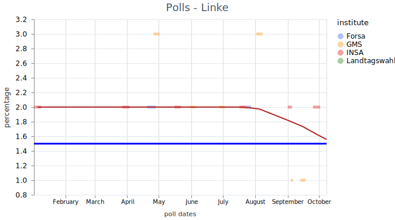
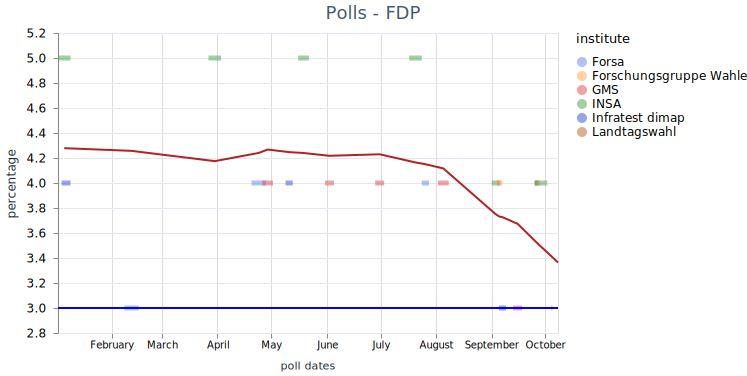
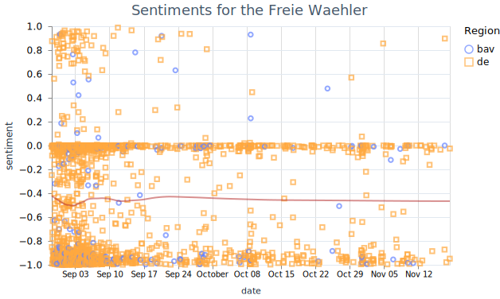
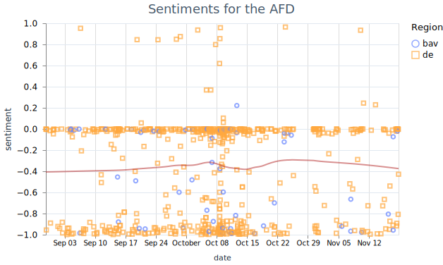

# Mastodon  - Election Predictions

## Introduction and Objectives

[Mastodon]([Annual Report 2022 - Mastodon Blog](https://blog.joinmastodon.org/2023/10/annual-report-2022/)) is a micro blogging service, that is federated by the [ActivityPub](https://en.wikipedia.org/wiki/ActivityPub) protocol and part of the fediverse. Depending on the source Mastodon 8.4 M users world wide ([fedidb](https://fedidb.org/)),  or 14.4 M users (@mastodonusercount@mastodon.social) on 30/10/2023. Because many services are able to federate with each other, it is possible to read data from other serveres as Misskey, Lemmy, Pixelfed and so on. Even some Wordpress-Blogs can be read.

Mastodon has a relative high number regional servers (see [OSM - Mastodon server](https://umap.openstreetmap.fr/en/map/mastodon-near-me-global-mastodon-server-list-by-co_828094)). A high number are German.  Mastodon had a strong spike in usage in November 2022 with 2.5 M monthly recurrent users. Currently the network has still [1.7 mio](https://joinmastodon.org/servers) monthly recurrent users.

Beside Mastodon, [X](https://developer.twitter.com/en/docs/twitter-api) was also investigated as possible source. But was excluded for monetary reasons. We will use the terms posts and toots interchangebly.

We analyse Mastodon toots about the bavarian election on Oct, 8th 2023. Therefore we apply a sentiment analysis. We atempt to differentiate regions and gender.

### Monitored Parties

The sentiment for the following parties will be watched (sorted from left to right):

| Party                     | Candidate(s)                        | Percentage 2018 |
| ------------------------- | ----------------------------------- | --------------- |
| Linke                     | Adelheid Rupp                       | 3.2             |
| SPD                       | Florian von Brunn                   | 9.7             |
| Grüne                     | Ludwig Hartmann & Katharina Schulze | 17.6            |
| FDP                       | Martin Hagen                        | 5.1             |
| CSU (Baverian only party) | Markus Söder                        | 37.2            |
| Freie Wähler              | Hubert Aiwanger                     | 11.6            |
| AfD                       | Katrin Ebner-Steiner & Martin Böhm  | 10.2            |

Source: [Landtagswahl in Bayern 2023: Kandidaten, Themen, Termin | BR24](https://www.br.de/nachrichten/bayern/landtagswahl-in-bayern-2023-termin-themen-kandidaten,TMD4uSM)

[Bayerische Linke kürt Adelheid Rupp als Spitzenkandidatin | BR24](https://www.br.de/nachrichten/bayern/bayerische-linke-kuert-adelheid-rupp-als-spitzenkandidatin,TZXl5yd)

### Polls

As a reference the sentiment analysis will be compared to polls. Tolls from different sources are listed at [wahlrecht.de]([Wahlumfragen zur Landtagswahl 2023 in Bayern (Sonntagsfrage #ltwby)](https://www.wahlrecht.de/umfragen/landtage/bayern.htm#fn-bp)). The time lime for each party for the is shown below. Fitting is done with a loess fit with a bandwith of 0.5 at the most median datetime of each poll. The result of the election is shown as `Landtagswahl`.

The strongest party `CSU` loses about three percent points since the start of the year 2023 with an result of 37 % at the election.

While its coalition partner `Freie Waehler` increases by five percent points and win 15.8 % of all votes.

Oppostion parties as  show a trend of loosing on the lefts spectrum and gaining in the ultra right spectrum (`AFD`). As the Linke only wins less then the percent in every poll, it is not listed by every polling institue.

 Both Linke and and FDP did not gain the minium amount of  five percent the join the state parliament.

## Population in Bavaria

Bavaria has slitly more woman (50.5 %) of about 13.3 mio inhatitans [Bevölkerung in den Gemeinden Bayerns nach Altersgruppen und Geschlecht](https://www.statistik.bayern.de/mam/produkte/veroffentlichungen/statistische_berichte/a1310c_202200.pdf). This is due to the age distrution of its citizen, because man have a higher mortability rate at higher ages.  The peer group  aged 40 to 50 is the first one with more than 50 %. All younger peer groups show an surplus of men by two to five percent. On the other hand, the peer group of  age 75 or higher show surplus of women of about 17 %.

## Methods

### Monitoring

Following tags are monitored on the instance *chaos.social* by the topics:

- Bavaria: bayern bayernwahl bayernwahl2023 

- Election: wahlen wahlkampf wahlumfrage wahlen23 wahlen2023 

- Parties: spd csu gruene  grune gruenen grunen afd freiewaehler freiewahler fw fpd linke 

- Candidates: markussoeder markussoder soeder soder hubertaiwanger aiwanger hartmann martinhagen ebnersteiner

Some candidates were not included, because their tags where not in used at the beginning of the study.

A wide set of topics have been selected to retrieve a maximum of taged posts. Due to the concept of federation of instances, it is possible that not all instances share posts, or not all posts. Still only a single instance have been monitored to reduce the need of removing doublicates with different ids on each instance. 

Search of posts without the need of tags, has been released during the monitoring with Mastodon version 4.2 in the end of September 2023.  It was added on October 3rd on chaos.social. Reindexing stated have been finished on October 5th. The search was added on October 7th to the monitoring.

We retrieve the tags via the public timeline of the instance and the search via the seach api

* ***instance_url/api/v1/timelines/tag/{tag_name}*** 

* ***isntance_url/api/v2/search?q={search_word}***

The search in the public timeline is done without a login, therefore only public posts are monitored. For the search a bearer token is neaded. During the addition of the search the limit of requested post was increased from 20 (default) to 40 (maximum).

The posts are requested every full hour starting 08/29/23. The retrieval is done with a Elixir programm that runs on Erlang's BEAM runtime, to increase stabiliy. For instance automatic recovering after failing connections. Each post is written into four tables of a SQLite3 database. The toots table contains the post itself and some of its user data. The users table contains some data of the posts about the users, who wrote the posts.

The related table fields contains the fields a user can set, to add some information about him-/herself. The related tags table contains all tags of every post.

### Data Analysis

#### Data Preparation

The evaluation is done in an [Elixir Livebook](election_bavaria.livemd). First exploration was done on a sub-sample of the dataset, which was recored until 09/10/23. About 12 days of full records. This dataset was used to fine tune the analysis. 

Filtering is down in three stages:

1) Cleaned text contains more than 50 characters of cleaned text.

2) Keep only posts spefic to bavaria.

3) Keep only posts that is attributable a single/dominant party.

The regional filter accepts any post that abides to any of the the three rules

1) Post must name any local entity

2) Post must name any candidate

3) Post must name csu (single regional only party)

For the local entity we take the state name down to village names. We do not use sub-district names, as they amount is much higher as and includes some major common german words (e.g. Gern, Oder). Is also partialy true for villages names, (e.g. Wald). 

For attributing the post to a party two methods are tested:

1) Keep posts, that only name a single party, or their candidate(s).

2) Keep posts, that contains a dominant party, that is mentioned more often than, all other party combined.

After appling all filters to the sub-sampled dataset we either keep 39 % of all posts (attribution to a single party), or 49 % of all posts (attribution to a dominant party). The connection between post and party is more clear with the first, but we choose the later version, as more posts are kept. Most left posts mention the FW (72 %), CSU (24 %), and AFD (2 %).

#### Spatial Differentiation

Based on [OSM - Mastodon server](https://umap.openstreetmap.fr/en/map/mastodon-near-me-global-mastodon-server-list-by-co_828094) following Mastodon instances are estimated to be used by bavarian users:

- muenchen.social

- augsburg.social

- mastodon.bayern

- nuernberg.social

- ploen.social

- wue.social (Würzburg)

- mastodon.dachgau.social

- sueden.social

We added sueden.social based on the untested hypothesis, that the overall sentiment in southern Germany is similar the Bavarian. In addition the fields and notes of each user are scanned for Bavarian location names [OpenData Geodaten Bayern](https://geodaten.bayern.de/opengeodata/OpenDataDetail.html?pn=verwaltung). Of the sample dataset we thus label 8.1 % of posts as Bavarian. 6.14 % due the uses instance, 0.4 % due to a Bavarian location a user field and 2.0 % due to a Bavarian location name in the user notes.

Following keys are used for the user fields: "adresse", "born where", "bundesland",  "city",  "country",  "heimat",  "heimathafen",  "heimatort",  "herkunft",  "home",  "location",  "ort",  "standort",  "wahlkreis",  "wo",  "wohnhaft",  "wohnort",  "wohnt in",  "zuhause",  "📍"

This message is most precise as the fields are key value stores. Location names that are common German words will not be missunderstood. Still location someelse with the same name are confused.

The full region selection algorith is shown below.

#### Sentiment Analysis

For the sentiment analysis at first we cleaned the texts before further filtering:

- Html tags

- Links 

- Characters #, @ and _ .

- Removed double spaces.

The cleaned posts with more than 50 characters in the evaluation data set contains 217 (median) and 248 +/- 189 (average and standard deviation) characters. The maxium was over 5000 characters. 

The posts all contain a language lable, but this is set by the user or his/her application and is therefore error prone. We detect the language by the model [***papluca/xlm-roberta-base-language-detection***]([papluca/xlm-roberta-base-language-detection · Hugging Face](https://huggingface.co/papluca/xlm-roberta-base-language-detection)) with a limit 0f 100 character. The model is included in the Livebook smart cells.

The german sentiment analysis is done with the model [***oliverguhr/german-sentiment-bert***]([oliverguhr/german-sentiment-bert · Hugging Face](https://huggingface.co/oliverguhr/german-sentiment-bert)). We limited the model to 437 of 512 possible characters (sum of average length and standard deviation). The model is a python package. Therefore we attempted to use is in Elixir via ONNX. The problem was the correct setting of the tokenizer (bert-base-german-cased). Therefore it was much simpler to use the Elixir library Bumblebee.

The few English language posts are evaluated with the model [***finiteautomata/bertweet-base-sentiment-analysis***]([finiteautomata/bertweet-base-sentiment-analysis · Hugging Face](https://huggingface.co/finiteautomata/bertweet-base-sentiment-analysis)) with the limit of 130 characters. 

The minimum of 50 characters was used, to reduce the miss classification. The language detection model for example classified these as Hindi or Thai, neither was true for all posts!

The whole language classification process is shown below.

 

#### Sentiment Graphs

In the sub-sample only the partys FW, CSU and AFD where mentioned often enough to create a timeline. The Sentiment is shown for the three regions/languages 

1) Bavaria.

2) Other German.

3) English.

For all parties most sentiments are neutral or negative. Whether positive sentiment is due to irony can not be tested automatically. Fitting is done with a loess fit with a bandwith of 0.5.

The average sentiment (loess fit) of the CSU ranges from -0.6 to -0.4.

The average sentiment (loess fit) for the FW ranges from -0.5 to -0.4.

The AFD was as only mentioned in two percent of all filtered posts. Therefore the data is already sparse. Therefore the average sentiment (loess fit) has a more dynamic of -0.7 to -0.1. Computing a daily, or weekly average might be more precise.

#### Plans: Correleation poll and sentiments

#### Plans: for Age and Gender Differtiation

As final differentiation the gender of each user is estimated by:

1. name

2. user note text

3. user fields

4. user picture?

Gender Classification with [Salesforce/blip-image-captioning-base · Hugging Face](https://huggingface.co/Salesforce/blip-image-captioning-base) that generates captions of images. The captions are scanned for man/woman.

**TODO Test:** [MiVOLO]([[2307.04616v2] MiVOLO: Multi-input Transformer for Age and Gender Estimation](https://arxiv.org/abs/2307.04616v2)), [onnx Gender and Age]( https://github.com/onnx/models/tree/main/vision/body_analysis/age_gender)

## Linklist

### Fediverse

- [fedidb](https://fedidb.org/)
- [OSM - Mastodon server](https://umap.openstreetmap.fr/en/map/mastodon-near-me-global-mastodon-server-list-by-co_828094)
- [Mastodon Python API](https://mastodonpy.readthedocs.io/en/stable/07_timelines.html)

### Umfragen

[Sonntagsfrage – Umfragen Landtagswahlen (Wahlumfrage, Wahlumfragen)](https://www.wahlrecht.de/umfragen/landtage/)

## Monitoring Interruptions
